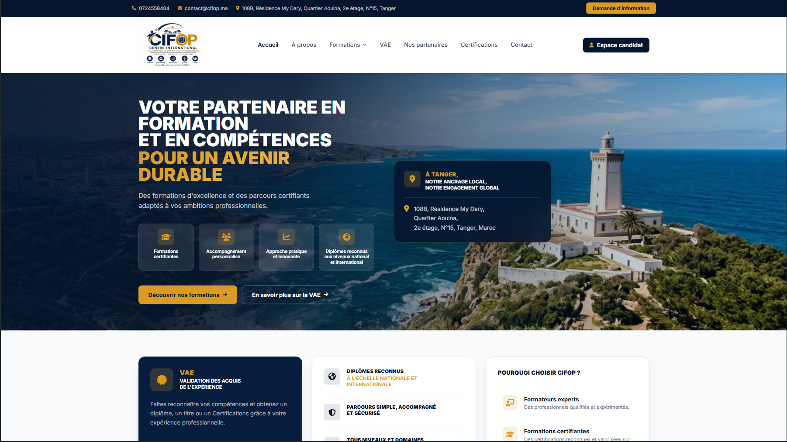
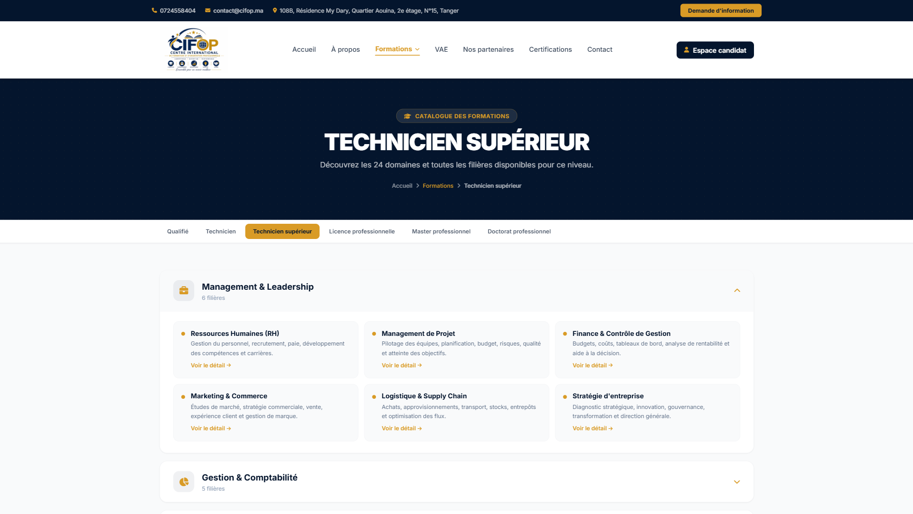
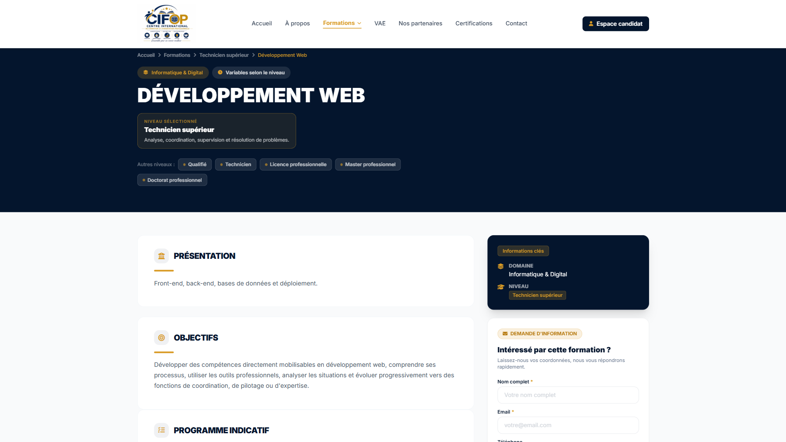
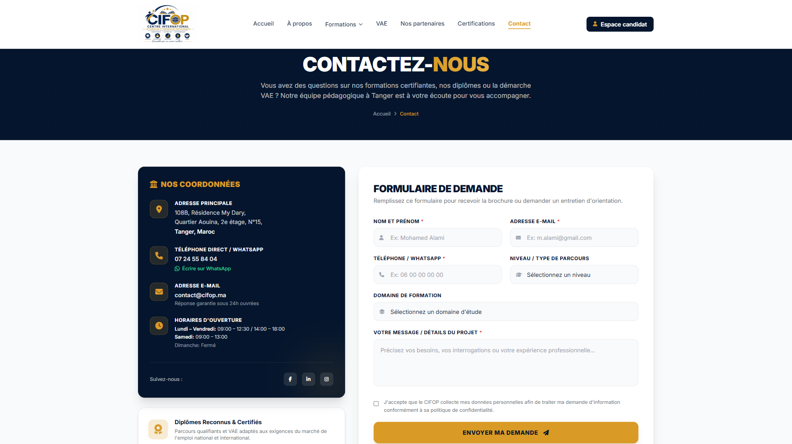
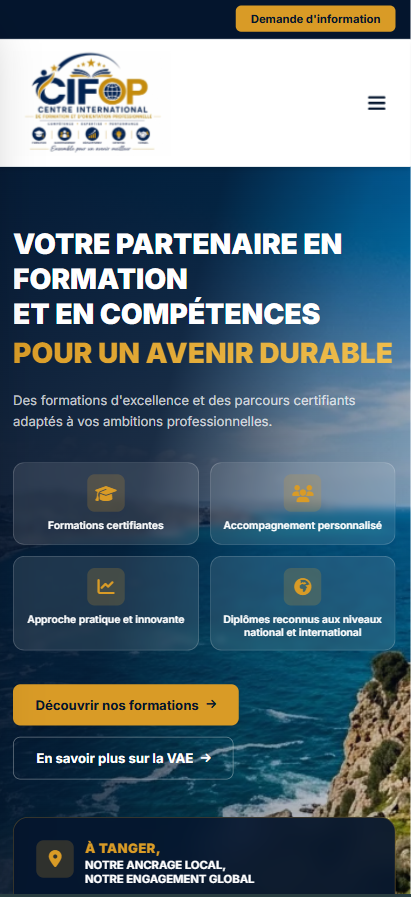

# CIFOP — Professional Training Platform

A professional website developed for **CIFOP Tanger**, a professional training institution in Tangier, Morocco.

🌐 **Live Website:** https://cifop.ma

## Overview

Designed and developed a complete web experience for CIFOP, focused on presenting and organizing professional training programs and providing visitors with a clear and responsive way to explore available training opportunities.

The project includes a dynamic backend connected to a MySQL database for managing training-related content.

## Features

* Responsive website
* Training programs catalog
* Training fields and program pages
* Dynamic content management
* Contact system
* Responsive navigation
* SEO-friendly structure
* Mobile-first responsive design
* Dynamic database-driven content

## Technologies

* HTML5
* CSS3
* JavaScript
* PHP
* MySQL
* PDO
* Apache

## My Role

**Full-stack development**

* UI implementation
* Frontend development
* Backend development
* Database integration
* Dynamic content management
* SEO structure
* Responsive implementation
* Deployment

## Screenshots

### Homepage

### Training Programs

### Program Details

### Contact Form

### Responsive Design

## Live Website

🌐 **[Visit CIFOP Website](https://cifop.ma)**

## Project Status

**Completed — Client Project**

## Note

This repository is a **portfolio case study**.

The source code is not included because the project was developed as a **client-owned commercial project**. The repository contains selected project information and visual materials for portfolio purposes.
